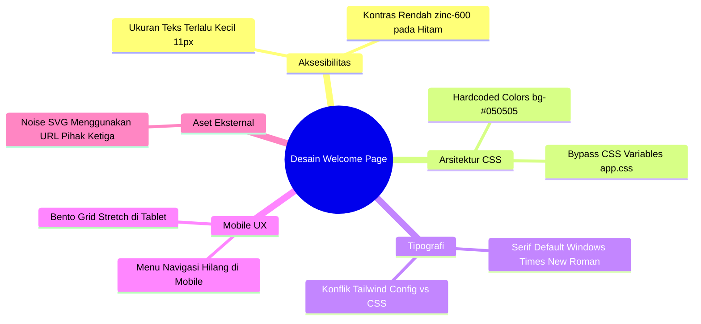

# KODAI.DEV Design System & Architecture Specification

Dokumen ini mendefinisikan sistem desain (design system) untuk proyek **kodai.dev**, yang dirancang dengan estetika **Premium Minimalist Developer & Systems Engineering Studio**.

> [!NOTE]
> Spesifikasi ini dirancang dan dievaluasi dari sudut pandang **Senior Frontend Architect** untuk memastikan keindahan visual berjalan selaras dengan performa, aksesibilitas (accessibility/a11y), dan skalabilitas kode.

---

## 1. Filosofi Desain (Design Philosophy)

Estetika visual **kodai.dev** dibangun di atas tiga pilar utama:
1. **Precision & Engineering**: Penggunaan grid yang tegas, border tipis, font monospace/clean-sans, serta ornamen berbasis kode untuk menonjolkan kesan profesionalitas teknis tinggi.
2. **Premium Dark Aesthetic**: Latar belakang hitam pekat (*true black*) dengan pencahayaan radial (*ambient glow*) dan tekstur grain (*noise*) untuk kedalaman visual yang modern dan eksklusif.
3. **Editorial Contrast**: Perpaduan sans-serif geometris yang sangat bersih dengan tipografi serif miring (*italic*) untuk memberikan sentuhan artistik dan premium yang kontras.

---

## 2. Kritik Senior Frontend (Honest Critique & Gaps)

Sebelum mengimplementasikan pembaruan, berikut adalah hasil evaluasi kritis terhadap desain welcome page saat ini:



### A. Inkonsistensi Tema & Hardcoded Colors (Arsitektur CSS)
*   **Masalah**: Halaman `Welcome.jsx` menggunakan warna gelap yang dipasang mati (*hardcoded*) melalui utilitas Tailwind seperti `bg-[#050505]`, `bg-[#070707]`, `border-white/10`, dan `bg-zinc-950/40`.
*   **Dampak**: Sistem ini mengabaikan variabel CSS semantic yang didefinisikan di `app.css` (`--background`, `--foreground`, dll). Jika aplikasi di masa mendatang memerlukan mode terang (Light Mode) atau sinkronisasi dengan preferensi sistem, halaman ini akan rusak karena nilainya bersifat statis.

### B. Masalah Aksesibilitas (Contrast & Readability - WCAG AA Standards)
*   **Masalah**: Penggunaan kelas warna `text-zinc-600` di atas latar belakang gelap gulita (`#050505`) memiliki rasio kontras yang sangat rendah (~1.8:1), jauh di bawah standar minimum WCAG AA sebesar **4.5:1** untuk teks biasa.
*   **Dampak**: Deskripsi fitur kecil ("Enterprise Backend" dan "Custom Web Apps") yang berukuran `text-[11px]` hampir tidak dapat dibaca oleh pengguna dengan keterbatasan penglihatan atau pada perangkat dengan kecerahan layar rendah.

### C. Tipografi yang Tidak Terstandarisasi
*   **Masalah**: Penggunaan `font-serif` pada kata-kata kunci editorial mengandalkan font serif bawaan sistem. Di sistem Windows, ini akan merender *Times New Roman* yang terkesan kuno, sedangkan di macOS akan merender *Georgia*.
*   **Dampak**: Estetika premium menjadi tidak konsisten antar sistem operasi. Sistem membutuhkan font serif spesifik (seperti *Instrument Serif* atau *Playfair Display*) untuk menjaga marjin kualitas estetika editorial.

### D. Kehilangan Fungsi Navigasi Mobile (Mobile UX)
*   **Masalah**: Menu navigasi utama (`Solutions`, `Blueprint`, `Consultation`) disembunyikan menggunakan kelas `hidden md:flex` tanpa ada alternatif menu hamburger atau drawer pada perangkat mobile.
*   **Dampak**: Pengguna ponsel kehilangan navigasi kontekstual untuk menjelajahi bagian-bagian halaman.

### E. Ketergantungan Aset Pihak Ketiga (External Dependency)
*   **Masalah**: Efek grain menggunakan URL eksternal: `https://grainy-gradients.vercel.app/noise.svg`.
*   **Dampak**: Jika server tersebut mati atau terjadi masalah jaringan, efek grain premium pada latar belakang tidak akan termuat.

---

## 3. Palet Warna & Tema Semantic (Semantic Color System)

Untuk memperbaiki arsitektur CSS, warna dipetakan menggunakan variabel CSS agar mendukung integrasi tema secara dinamis:

| Nama Variabel CSS | Nilai Warna (Dark) | Penggunaan Semantik |
| :--- | :--- | :--- |
| `--background` | `#050505` | Latar belakang halaman utama |
| `--background-secondary`| `#070707` | Latar belakang seksi Blueprint |
| `--foreground` | `#ffffff` | Judul utama dan teks kontras tinggi |
| `--muted-foreground` | `oklch(0.708 0 0)` | Teks penjelasan reguler |
| `--border` | `rgba(255, 255, 255, 0.1)`| Batas tepi panel / grid line |
| `--accent-cyan` | `#06b6d4` | Aksen utama, link aktif, border-hover |
| `--accent-purple` | `#a855f7` | Aksen sekunder, fokus alur kerja |

---

## 4. Standar Tipografi Baru (Typography Standards)

Pembaruan tipografi mewajibkan pemuatan font Google Fonts berlisensi bebas secara lokal atau melalui CDN handal:

1.  **Sans-Serif (Geist Sans / Inter)**:
    *   Digunakan untuk teks antarmuka, label menu, paragraf deskriptif.
    *   Pengaturan: `font-sans font-light tracking-wide`
2.  **Serif Editorial (Instrument Serif / Playfair Display)**:
    *   Digunakan eksklusif untuk kata-kata penekanan emosional (*italic*) pada heading utama.
    *   Pengaturan: `font-serif italic font-normal text-transparent bg-clip-text bg-gradient-to-r from-cyan-400 to-purple-400`
3.  **Monospace (Geist Mono / Fira Code)**:
    *   Digunakan untuk nomor urut langkah proses, badge teknis, dan dekorasi sintaks kode.
    *   Pengaturan: `font-mono tracking-widest text-zinc-500`

### Skala Hierarki Baru:
*   `Display 1`: `text-5xl sm:text-7xl md:text-9xl font-extralight tracking-tight leading-[0.85]`
*   `Heading 2`: `text-3xl md:text-4xl font-light tracking-tight`
*   `Body Text`: `text-sm md:text-base text-zinc-400 font-light leading-relaxed`
*   `Caption / Metadata`: `text-xs font-mono uppercase tracking-[0.2em] text-zinc-500`

---

## 5. Blueprint Komponen UI & Layout Refactoring

### A. Bento Grid & Asymmetric Layout
*   Gunakan batas minimum ukuran teks deskripsi `text-[13px]` atau `text-xs`.
*   Ganti warna teks deskripsi dari `text-zinc-600` menjadi `text-zinc-400` untuk meningkatkan rasio kontras.
*   Tambahkan pembungkus interaksi fokus keyboard (`focus-within:ring-2 focus-within:ring-cyan-500`).

### B. Floating Navbar dengan Mobile Drawer
*   Tambahkan tombol hamburger menu (`Menu` / `X`) pada tampilan mobile.
*   Gunakan slide-down drawer dengan latar belakang blur transparan (`backdrop-blur-2xl bg-zinc-950/90`) untuk menampung link navigasi pada layar kecil.

### C. Aset Grain Lokal
*   Unduh file `noise.svg` dan simpan secara lokal pada `/public/assets/images/noise.svg`.
*   Muat file tersebut secara lokal untuk menjamin keandalan sistem latar belakang.

---

## 6. Panduan Implementasi Animasi & Efek Hover

*   **Hover Glow Effect**:
    *   Saat elemen Bento Card di-hover, selain perubahan warna border, tambahkan sedikit peningkatan intensitas pencahayaan di dalam box menggunakan efek radial gradasi transparan:
    ```css
    background: radial-gradient(circle at var(--mouse-x) var(--mouse-y), rgba(6, 182, 212, 0.15), transparent 80%);
    ```
*   **Active Click State**:
    *   Untuk semua tombol interaktif, tambahkan efek klik fisik: `active:scale-[0.98] transition-transform duration-100`.
