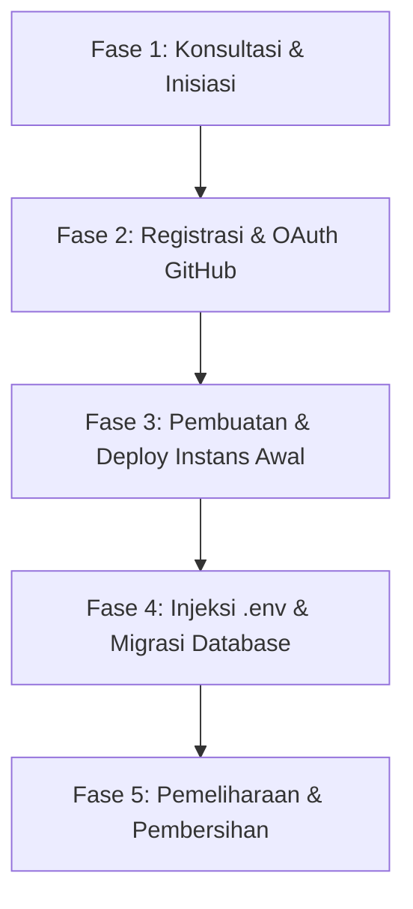

# KODAI.DEV Detailed Project Analysis & Business Specification

Dokumen ini menyajikan analisis menyeluruh tentang sistem **kodai.dev**, yang mencakup peruntukan platform, proses bisnis ujung-ke-ujung (*end-to-end*), arsitektur teknis, skema database, hingga temuan celah teknis (*technical gaps*) dan bug tersembunyi.

---

## 1. Peruntukan & Target Pengguna (Platform Allocation)

**kodai.dev** memposisikan dirinya sebagai **Systems Engineering Studio** & penyedia layanan **Architect As A Service**. Platform dasbor terautentikasi (Pusat Kendali / Terminal Kodaidev) ditujukan untuk dua segmen pengguna utama:

1.  **Klien Studio (Mahasiswa/Bisnis)**:
    *   **Klien Akademik**: Mahasiswa IT yang memesan pengerjaan Tugas Akhir atau Skripsi. Platform ini memberi mereka visualisasi kemajuan coding yang transparan, repositori terisolasi, dan database terkonfigurasi otomatis agar mereka siap menghadapi ujian dengan percaya diri.
    *   **Klien Bisnis**: UMKM atau perusahaan yang membutuhkan produk perangkat lunak khusus (SaaS, E-Commerce, Custom Dashboard).
2.  **Tim Pengembang Kodaidev (Internal)**:
    *   Alat bantu sysadmin dan developer internal untuk menguji, mendeploy, dan menyajikan aplikasi hasil kerja ke klien secara instan tanpa perlu melakukan konfigurasi server Nginx, SSL, atau database secara manual berulang kali.

---

## 2. Proses Bisnis Utama (Business Processes)

Proses bisnis **kodai.dev** dibagi ke dalam 5 fase berkelanjutan:



### Fase 1: Konsultasi & Inisiasi
*   Klien berdiskusi mengenai spesifikasi teknis dan blueprint sistem (ERD, Class Diagram, Flowchart) melalui tautan WhatsApp yang disediakan di welcome page.
*   Tim Kodaidev membuat repositori di GitHub untuk proyek tersebut.

### Fase 2: Registrasi & OAuth GitHub
*   Klien atau pengembang masuk ke Pusat Kendali menggunakan opsi autentikasi **GitHub OAuth** yang diintegrasikan via **Laravel Socialite**.
*   Saat masuk pertama kali, sistem secara otomatis:
    1.  Mencari user berdasarkan email GitHub.
    2.  Jika belum ada, sistem mendaftarkan pengguna baru dengan kata sandi acak yang aman.
    3.  Menyimpan atau memperbarui token GitHub (`github_token`) dan token penyegar (`github_refresh_token`) milik pengguna untuk digunakan pada proses kloning repositori privat.

### Fase 3: Pembuatan & Deploy Instans Awal (Deployment Engine)
1.  **Pengiriman Formulir**: Pengguna memasukkan Nama Proyek, nama repositori GitHub (`fathur/app`), nama branch (`main`), domain kustom (opsional), serta **Master Password** khusus.
2.  **Validasi Backend & Keamanan**: Pengontrol `ProjectController` memverifikasi Master Password (di-hardcode bernilai `11223344`). Jika tidak cocok, permintaan ditolak.
3.  **Pembuatan Subdomain Dinamis**: Sistem membersihkan nama proyek menjadi slug ramah URL (misal: "Sanjai App" -> `sanjai-app`). Jika subdomain sudah digunakan oleh proyek lain, sistem secara cerdas menambahkan angka increment di belakangnya (`sanjai-app-1`, `sanjai-app-2`, dst).
4.  **Kloning Kode Sumber Latar Belakang (Asynchronous Job)**:
    *   Sistem memicu antrean `DeployProject` yang berjalan di latar belakang.
    *   Sistem mengubah status proyek menjadi `building` dan membuat log deployment baru.
    *   Mengunduh repositori menggunakan autentikasi token GitHub pengguna: `https://{github_token}@github.com/{github_repo}.git`.
    *   Menghapus folder lama jika terjadi redeployment untuk menghindari konflik file.
5.  **Instalasi Dependensi Awal & Analisis Arsitektur**:
    *   Jika berkas `composer.json` ditemukan: menjalankan `composer install` untuk mengunduh paket backend PHP.
    *   Jika berkas `package.json` ditemukan: menjalankan `npm install && npm run build` untuk mengkompilasi file frontend.
6.  **Otomatisasi Nginx & Routing**:
    *   Mendeteksi folder root aplikasi: jika folder `/public` ada (ciri khas Laravel), itu ditunjuk sebagai folder root Nginx. Jika hanya ada `/dist` (ciri khas React SPA murni), itu yang akan menjadi folder root.
    *   Menulis file konfigurasi *Virtual Host* Nginx baru, memicu symlink ke direktori `sites-enabled`, dan memicu reload server Nginx secara asinkron (`sudo systemctl reload nginx`).
    *   Jika sukses, status proyek diperbarui menjadi `active` dan siap diakses melalui http.

### Fase 4: Injeksi `.env` & Migrasi Database
Setelah instans awal aktif, klien dapat menyetel file environment (`.env`) melalui modal konfigurasi di dasbor:
1.  **Deteksi & Pembersihan Kredensial Database**: 
    *   Sistem membaca teks `.env` yang diinputkan pengguna.
    *   Sistem membuang seluruh baris konfigurasi database (`DB_*`) milik pengguna menggunakan regular expression (`preg_replace('/^DB_.*$/m', '', $env_text)`).
2.  **Pembuatan Database MySQL Otomatis**:
    *   Sistem membuat database MySQL baru di localhost dengan format nama `kodai_<subdomain>` (karakter strip diganti dengan garis bawah).
    *   Sistem memberikan hak akses penuh ke pengguna database lokal bernama `'fathur'@'localhost'`.
3.  **Injeksi Kredensial Database Terisolasi**:
    *   Sistem menginjeksi kredensial database lokal Kodaidev yang valid secara otomatis di bagian bawah berkas `.env` proyek.
4.  **Eksekusi Perintah Artisan**:
    *   Sistem memicu serangkaian perintah di folder proyek: `php artisan key:generate --force`, `php artisan migrate --force` untuk migrasi tabel database, `php artisan storage:link`, `npm install && npm run build`, dan optimalisasi cache.
5.  **Self-Healing Nginx & Otomatisasi SSL (HTTPS)**:
    *   Nginx diperiksa kembali untuk menjamin routing aktif.
    *   Sistem memicu Certbot secara non-interaktif (`sudo certbot --nginx -d {domain}`) untuk mendaftarkan sertifikat HTTPS (SSL) Let's Encrypt gratis secara instan.

### Fase 5: Pemeliharaan & Pembersihan (Destroy Project)
Apabila masa kontrak berakhir atau proyek dihapus dari dasbor:
1.  Folder proyek di `/home/fathurrangga92/kodaidev-apps/{subdomain}` dihapus bersih menggunakan perintah `rm -rf`.
2.  Konfigurasi Nginx di `sites-available` dan `sites-enabled` dihapus, diikuti dengan memicu reload Nginx.
3.  Database MySQL `kodai_{subdomain}` dihapus bersih menggunakan perintah `DROP DATABASE IF EXISTS`.
4.  Sertifikat SSL dihapus dari Certbot (`sudo certbot delete`).
5.  Seluruh baris riwayat proyek di database dasbor dibersihkan.

---

## 3. Arsitektur Teknis & Skema Database

Sistem dibangun di atas teknologi **Laravel 11, React (InertiaJS), Tailwind CSS, MySQL, Nginx, dan Ubuntu Server/Linux**.

### Skema Database Relasional

```
+------------------+         +------------------+         +-------------------+
|      users       |         |     projects     |         |    deployments    |
+------------------+         +------------------+         +-------------------+
| id (PK)          |1       *| id (PK)          |1       *| id (PK)           |
| name             |---------| user_id (FK)     |---------| project_id (FK)   |
| email            |         | name             |         | commit_hash       |
| email_verified_at|         | github_repo      |         | status            |
| password (null)  |         | branch           |         | log_output        |
| github_id        |         | subdomain        |         | created_at        |
| github_token     |         | custom_domain    |         | updated_at        |
| github_refresh_t |         | status           |         +-------------------+
| created_at       |         | created_at       |
| updated_at       |         | updated_at       |
+------------------+         +------------------+
```

1.  **Tabel `users`**:
    *   Menampung informasi akun pengguna.
    *   `github_token` dan `github_refresh_token` disimpan secara plain-text untuk otorisasi kloning otomatis oleh pekerja antrean.
2.  **Tabel `projects`**:
    *   Menyimpan meta-data proyek yang dideploy.
    *   Kolom `status` bertipe string dengan nilai kemungkinan: `pending`, `building`, `active`, atau `failed`.
3.  **Tabel `deployments`**:
    *   Menyimpan histori setiap kali proses deploy berjalan.
    *   Kolom `log_output` bertipe `longText` untuk mencatat log konsol saat instalasi npm/composer dan migrasi dijalankan, sehingga klien dapat mendiagnosis jika terjadi kegagalan kompilasi.

---

## 4. Temuan Celah Teknis & Bug Kritis (Critical Technical Gaps)

Hasil analisis mendalam menemukan **2 celah kritis** yang dapat menggagalkan operasional aplikasi:

### A. Bug Kritis Form React: `deploy_password` Tidak Dikirim
*   **Temuan**: File pengontrol `ProjectController.php` (baris 15-28) mewajibkan input `'deploy_password' => 'required|string'` dan memvalidasi nilainya harus sama dengan `'11223344'` (Password Master Kodaidev).
*   **Masalah**: File tampilan `Dashboard.jsx` tidak memiliki elemen input teks apa pun untuk `deploy_password`, dan state pengiriman data `useForm` hanya diisi oleh `name`, `github_repo`, `branch`, dan `custom_domain`.
*   **Dampak**: Setiap kali pengguna mencoba menekan tombol "Mulai Deploy", validasi Laravel akan selalu gagal dan mengembalikan error `Password Master wajib diisi untuk melakukan deploy.`, sehingga **fitur deployment di dasbor lumpuh total bagi pengguna biasa**.

### B. Potensi Exception Mass Assignment pada OAuth GitHub
*   **Temuan**: Saat pengguna masuk menggunakan GitHub, berkas `GitHubController.php` (baris 24-33) memicu fungsi `updateOrCreate` untuk mengisi kolom `github_id`, `github_token`, dan `github_refresh_token`.
*   **Masalah**: Model `User.php` menggunakan PHP Attribute `#[Fillable(['name', 'email', 'password'])]` untuk membatasi kolom yang boleh diisi. Kolom bertema GitHub tidak terdaftar di dalam deklarasi `Fillable` tersebut.
*   **Dampak**: Tergantung pada versi spesifik Laravel 11 dan cara pembacaan PHP attribute tersebut, pemanggilan `updateOrCreate` dapat memicu `MassAssignmentException` atau mengabaikan pembaruan token GitHub secara diam-diam.
